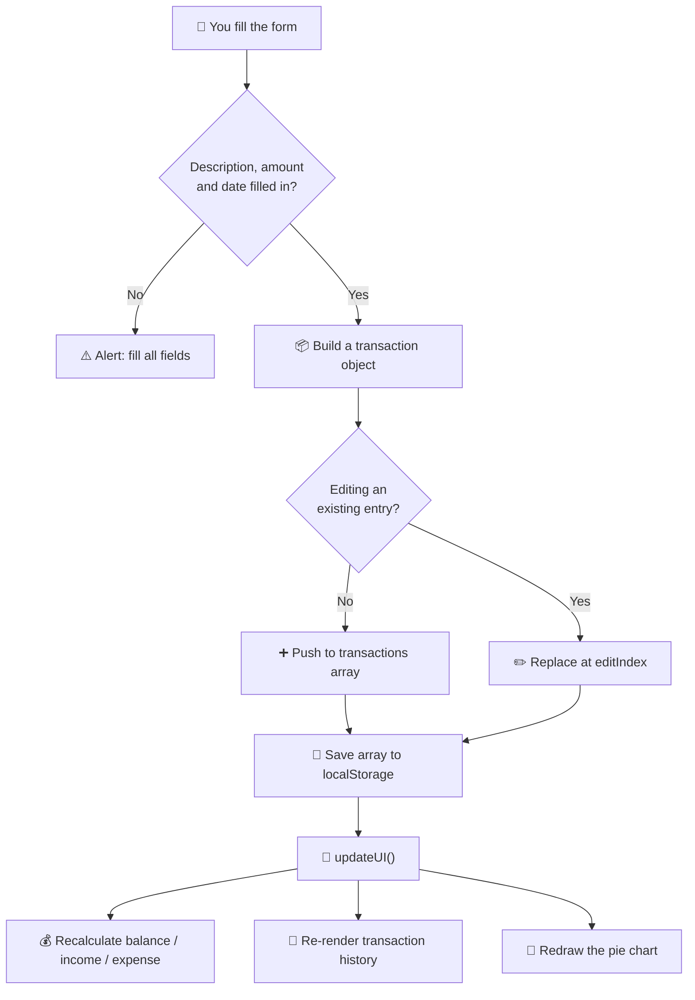

<div align="center">

# 💰 Expense Tracker Pro

**Know where your money actually goes — without handing your data to anyone.**

A single-page expense tracker that runs entirely in your browser. No account, no server, no tracking. Your transactions never leave your device.

[](#)
[](#)
[](#)
[](https://www.chartjs.org/)
[](LICENSE)
[](#)

</div>

---

## 📖 The idea

Most expense apps want your phone number, your email, and a permanent connection to their servers. For something as simple as *"how much did I spend on food this month?"*, that's a bad trade.

So this is the opposite of that:

> Open one HTML file. Type what you spent. See a chart. Close the tab. Everything you entered is still there tomorrow — stored in your own browser, on your own machine.

That's the whole concept. Three files, nothing to install, no accounts.

---

## ✨ What it does

| | Feature | What it means for you |
|---|---|---|
| 💵 | **Income & expense in one place** | Positive amount = income, negative = expense. One form for both. |
| 📊 | **Live balance dashboard** | Total balance, income and expense update the instant you add something. |
| 🥧 | **Pie chart breakdown** | See at a glance which category is quietly eating your money. |
| 🏷️ | **10 categories** | Salary, Food, Shopping, Travel, Bills, Entertainment, Water, Oil, Vegetables, Spices. |
| 💳 | **Payment methods** | Cash, UPI, Debit Card, Credit Card, Net Banking, Cheque. |
| 🔍 | **Instant search** | Type a few letters, the list filters as you go. |
| 🗂️ | **Category filter** | Show only Food, only Bills, only whatever you need. |
| ✏️ | **Edit & delete** | Got the amount wrong? Fix it in place. |
| 🌙 | **Dark mode** | One click, and it remembers your choice next time. |
| 💾 | **Automatic save** | `localStorage` keeps everything. Refresh, reboot, come back next week. |
| 📱 | **Works on your phone** | Responsive layout down to small screens. |

---

## 🧠 How it works

The mental model is small enough to hold in your head:



Everything hangs off **one array**, `transactions`. Every action — add, edit, delete — changes that array, writes it to `localStorage`, then calls `updateUI()` to repaint the screen from scratch. There's no clever state management because there doesn't need to be any.

### The data shape

Each transaction is a plain object:

```js
{
  description: "Groceries for the week",
  amount: -1250,          // negative = expense, positive = income
  category: "vegtables",
  date: "2026-09-15",
  payment: "UPI",
  receipt: ""             // optional receipt image
}
```

The sign of `amount` is doing a lot of work here. It's what splits income from expense, drives the balance, and decides what shows up in the chart — no separate "type" field needed.

---

## 🗂️ Project structure

```
expense-tracker-v1/
├── index.html        # Structure — dashboard, form, history list, chart canvas
├── css/
│   └── style.css     # Styling, cards, dark mode, mobile breakpoints
├── js/
│   └── script.js     # All the logic — state, storage, rendering, chart
├── LICENSE           # GNU GPL v3
└── README.md         # You are here
```

No `node_modules`, no build step, no config files.

### The functions, in plain English

| Function | Job |
|---|---|
| `addTransaction()` | Reads the form, validates it, adds or updates an entry, saves. |
| `updateUI()` | The heartbeat — recalculates totals and repaints everything. |
| `displayTransactions(data)` | Renders the history cards. Takes a list, so search and filter reuse it. |
| `editTransaction(i)` | Loads an entry back into the form and flips the button to "Update". |
| `deleteTransaction(i)` | Confirms, removes, saves. |
| `searchTransaction()` | Filters by description text as you type. |
| `filterTransactions()` | Filters by selected category. |
| `drawChart()` | Totals up expenses per category and draws the pie. |
| `toggleTheme()` | Flips dark mode and remembers it. |

---

## 🚀 Getting started

**The quick way**

Download the repo, double-click `index.html`. Done. It runs.

**The slightly better way** — a local server avoids a few browser quirks with file inputs:

```bash
git clone https://github.com/sampath2417k/expense-tracker-v1.git
cd expense-tracker-v1

# Python
python3 -m http.server 8000

# or Node
npx serve
```

Then open `http://localhost:8000`.

**Hosting it**

Pure static files, so GitHub Pages, Netlify, Cloudflare Pages or any dumb file host will serve it as-is. Push and point Pages at the root of the branch.

---

## 🧾 How to use it

1. **Adding income** — type a **positive** amount. `50000` for salary.
2. **Adding an expense** — type a **negative** amount. `-350` for lunch.
3. Pick a category, a date, and how you paid.
4. Hit **Add Transaction**.
5. The balance, the history and the pie chart all update immediately.

To fix a mistake, hit ✏️ **Edit** on the card — it loads back into the form and the button becomes **Update Transaction**.

---

## 🛠️ Built with

- **HTML5** — semantic structure, native date and file inputs
- **CSS3** — Flexbox layout, custom cards, a `.dark-mode` class that recolours everything
- **Vanilla JavaScript** — no framework, no transpiler, no bundler
- **[Chart.js](https://www.chartjs.org/)** — the only external dependency, loaded from CDN
- **Web Storage API** — `localStorage` as the database

---

## 🔒 On privacy

Worth being explicit, since that's the point of the project:

- There is **no backend**. Nothing is sent anywhere.
- Your transactions live in your browser's `localStorage`, tied to that browser on that device.
- The only network request is Chart.js from jsDelivr on page load. Want it fully offline? Download `chart.umd.js`, drop it in `js/`, and swap the CDN `<script>` tag for a local path.
- Clearing your browser data **will** wipe your transactions. There's no cloud copy — that's the trade-off.

---

## 🗺️ Roadmap

Things I know are rough and plan to fix:

- [ ] **Receipt upload doesn't persist yet** — the image is read inside `clearForm()` instead of `addTransaction()`, so nothing gets attached. Blob URLs wouldn't survive a refresh either; it needs converting to a base64 data URL before saving.
- [ ] **Search and filter don't stack** — using one resets the other. They should combine into a single filter pipeline.
- [ ] **Edit/delete use the visible index** — deleting while a search or filter is active can hit the wrong row. Needs a stable ID per transaction instead of array positions.
- [ ] **Export / import as JSON or CSV** — so backups and moving between devices are possible.
- [ ] **Monthly view** — filter by month, compare month over month.
- [ ] **Budget limits** — set a cap per category and get warned when you're close.
- [ ] **Replace `alert()` and `confirm()`** with inline toasts and proper modals.
- [ ] **Tidy the category list** — fix the `vegtables` typo and the inconsistent casing.
- [ ] **Bundle Chart.js locally** for genuine offline use.

---

## 🤝 Contributing

Issues and pull requests are welcome. If you're picking something up, the roadmap above is the honest list of what needs doing.

---

## 📜 License

Licensed under the **GNU General Public License v3.0**. Use it, change it, share it — just keep it free. See [LICENSE](LICENSE) for the full text.

---

<div align="center">

**Built by [M.Yugandhar](https://github.com/Yugandhar2213)**

If this was useful, a ⭐ on the repo goes a long way.

</div>
